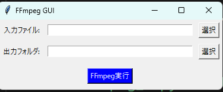

# FFmpeg GUI App 日本語
**※For the English version of this README, please scroll down.**

DaVinci Resolveで作成した動画をモバイルアプリで投稿すると「動画をプレビューできません」とエラーが発生します。これは、DaVinci Resolve から ビデオをエクスポートする場合、ファイルにタイムコード (tmcd) トラックを追加されるため、Android 上の一部のアプリケーションがファイルを開くことができないそうです。

これを解決するため、FFmpeg コマンドを実行します。Python と `tkinter` で構築されたシンプルなデスクトップ アプリケーションで、該当動画を変換します。ユーザーは入力ビデオ ファイルと出力フォルダーを選択でき、FFmpeg コマンドを実行してビデオを変換します。

## アプリで内部的に実行されるコマンド Features
- 入力ビデオ ファイルを選択します。
- 処理されたファイルの出力フォルダーを指定します。
- FFmpeg コマンドを実行します:

```
ffmpeg -i input-video.mov -c:a copy -c:v copy -write_tmcd 0 output-video.mov
```

## 実行には以下の環境が必要です Requirements
- Windows OS
- FFmpeg がインストールされ、システムの PATH に追加されている(`ffmpeg -version`コマンドの実行でバージョンが表示される)
- Python (exeファイルではなく、ソースコードを実行する場合、pythonが必要)

## 使い方 How to Use　

### 実行ファイルの使用 Using the Executable
1. [Releases](https://github.com/sil-co/ffmpeg-for-davinci/releases) から実行ファイルをダウンロードします。
2. `.exe` ファイルをダブルクリックしてアプリケーションを起動します。
3. 入力ビデオファイルと出力フォルダーを選択します。
4. 「FFmpeg 実行」ボタンをクリックしてビデオを処理します。

### ソースコードを使って実行する場合 Running the Source Code
1. リポジトリをクローンします:
```bash
git clone https://github.com/sil-co/ffmpeg-for-davinci.git
cd ffmpeg-for-davinci
```
2. 仮想環境を作成します (推奨):
```bash
python -m venv myvenv
source myvenv/bin/activate # Windowsの場合: myvenv\Scripts\activate
```
3. `requirements.txt` から依存関係をインストールします:
```bash
pip install -r requirements.txt
```
4. アプリケーションを実行します:
```bash
python ./src/ffmpeg_tk.py
```

## ライセンス License
このプロジェクトは MIT ライセンスの下でライセンスされています。詳細については、`LICENSE` ファイルを参照してください。

## 謝辞 Acknowledgments
- [FFmpeg](https://ffmpeg.org/): このアプリケーションで使用される強力なマルチメディア フレームワーク。

## デモスクリーンショット Demo Screenshots


---
リポジトリへの貢献や問題の報告はお気軽にどうぞ!

---

# FFmpeg GUI App English

When posting a video created with Davinci Resolve on the mobile app, an error message "Cannot preview video" appears. This is because when exporting a video from DaVinci Resolve, a timecode (tmcd) track is added to the file, which means some applications on Android cannot open the file.

To solve this, run the FFmpeg command. A simple desktop application built with Python and `tkinter` that converts the video. The user can select the input video file and output folder, and the FFmpeg command is executed to convert the video.

## Features
- Select an input video file.
- Specify an output folder for the processed file.
- Executes the following FFmpeg command:

```
ffmpeg -i input-video.mov -c:a copy -c:v copy -write_tmcd 0 output-video.mov
```

## Requirements
- Windows operating system
- FFmpeg installed and added to the system's PATH
- Python (if running the source code)

## How to Use　

### Using the Executable
1. Download the executable file from the [Releases](https://github.com/sil-co/ffmpeg-for-davinci/releases).
2. Double-click the `.exe` file to launch the application.
3. Select an input video file and output folder.
4. Click the "FFmpeg実行" button to process the video.


### Running the Source Code
1. Clone the repository:
   ```bash
   git clone https://github.com/sil-co/ffmpeg-for-davinci.git
   cd ffmpeg-for-davinci
   ```
2. Create a virtual environment (recommended):
   ```bash
   python -m venv myvenv
   source myvenv/bin/activate   # On Windows: myvenv\Scripts\activate
   ```
3. Install dependencies from `requirements.txt`:
   ```bash
   pip install -r requirements.txt
   ```
4. Run the application:
   ```bash
   python ./src/ffmpeg_tk.py
   ```

## License
This project is licensed under the MIT License. See the `LICENSE` file for details.

## Acknowledgments
- [FFmpeg](https://ffmpeg.org/): A powerful multimedia framework used in this application.

## Screenshots


---
Feel free to contribute or report issues in the repository!
